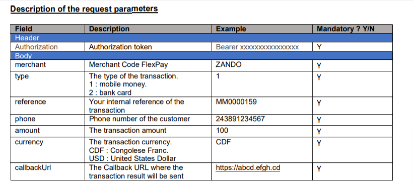
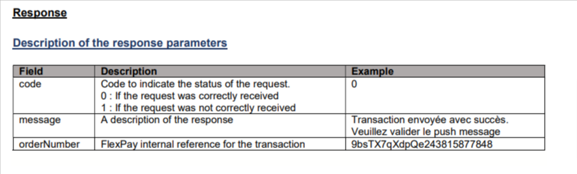
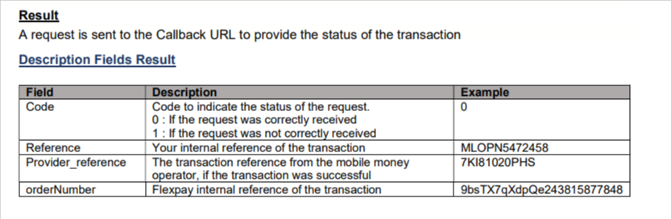
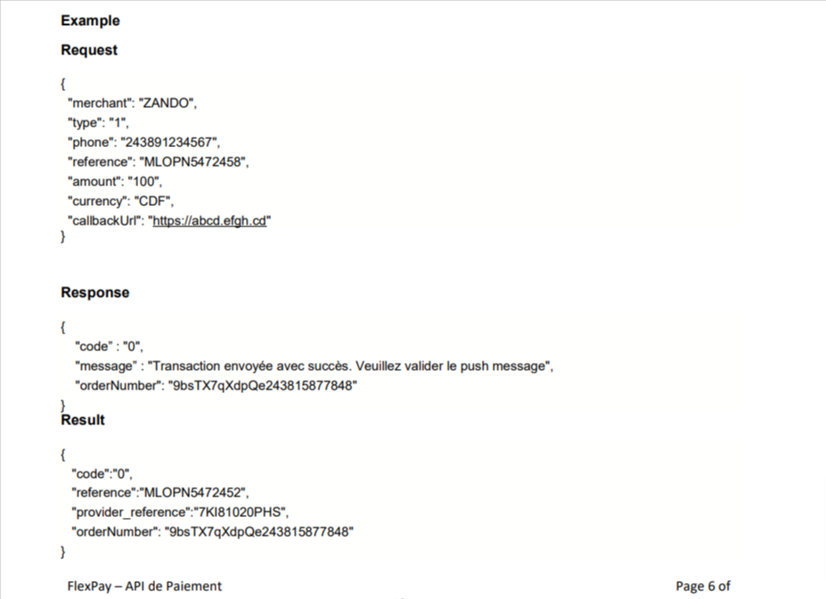
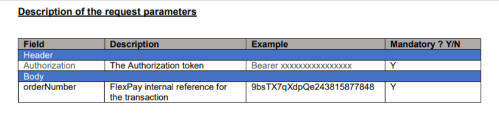
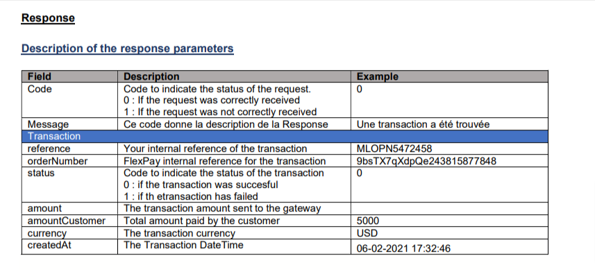
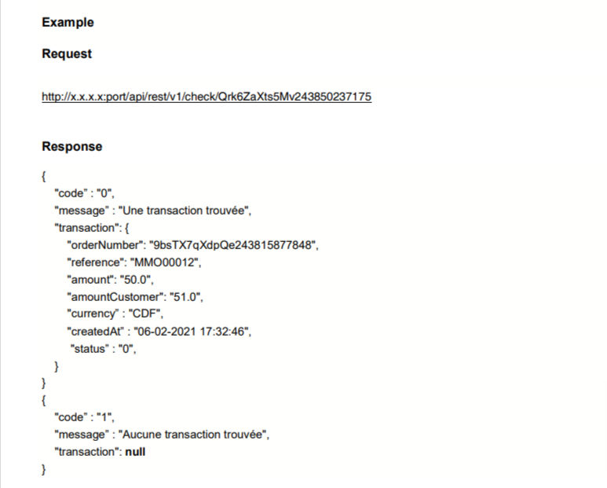

     
   
          

# pyflexpay
> A Python SDK for the FlexPay API used by Corporate Merchants to
> connect to FlexPay to perform mobile money transactions.

The FlexPay API provides access to two interfaces, the interface for sending
the request (Payment Service) and that for verifying the
transaction (Check transaction).

### Table of Contents
- [Payment Service](#Payment-Service)
- [Check Transaction](#Check-transaction)
- [QuickStart](#QuickStart)
- [Documentation/Usage](#Documentation)
- [Contributing](#Contributing)
- [Credits](#Credits)

---

## Payment Service
This service is used to send a payment request to FlexPay
- URL: https://ip:port/api/rest/v1/paymentService
- Method: POST
- Format: JSON

### Request



### Response



### Result


### Example


## Check transaction
This service is used to check the status of a payment request previously sent to FlexPay.
- URL: http://ip:port/api/rest/v1/check/orderNumber
- Method: GET

### Request



### Response



### Example


---

## QuickStart
#### Installation

```
pip install pyflexpay
```
#### From Source
```
git clone https://github.com/TralahM/pyflexpay
cd pyflexpay

python setup.py bdist_wheel
pip install -e .

```
---

## Documentation

[](https://pyflexpay.readthedocs.io)


#### API Reference

---
## Contributing

---

## Credits
[](https://github.com/TralahTek)
[](https://github.com/TralahM)
[](https://github.com/TralahM)


[](https://github.com/TralahM)
[](https://twitter.com/TralahM)
[](https://kaggle.com/TralahM)
[](https://linkedin.com/in/TralahM)


[](https://tralahm.github.io)

[](https://github.com/tralahtek)
---
